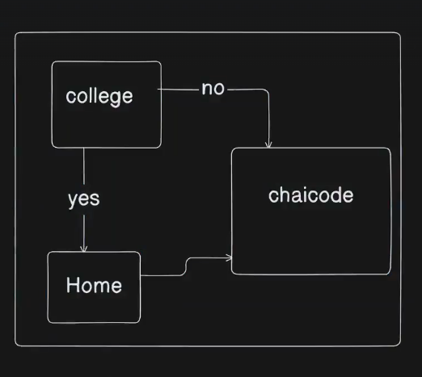
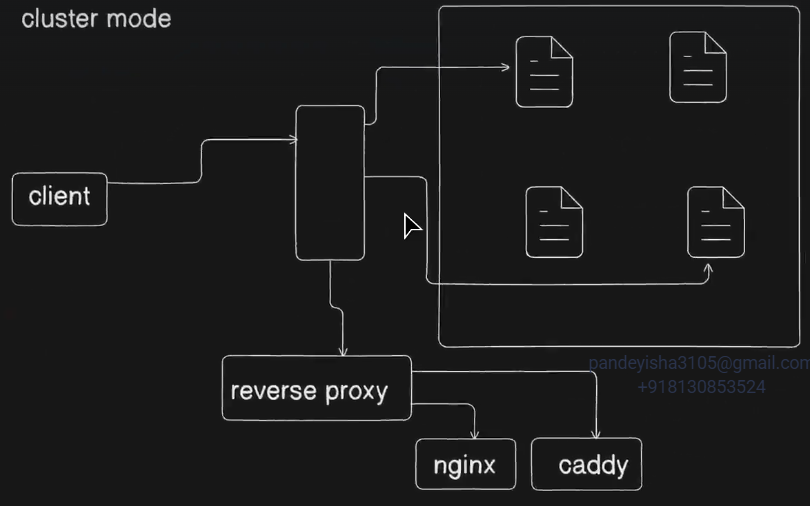

# 🚀 Caddy Server & The Power of Reverse Proxies

## 🌐 Why Do We Need a Reverse Proxy?

When deploying a backend application (like a Node.js server), you don’t want to expose it directly to the internet on `localhost:3000` or `localhost:5000`.

A **reverse proxy** acts as a smart gatekeeper between the client (browser) and your backend service.

### 🔧 Benefits of Using a Reverse Proxy:

- ✅ **Expose port 80/443** (HTTP/HTTPS) while your app runs on a private port (e.g., 3000)
- 🔐 **Add SSL/TLS (HTTPS)** without touching app code
- 🌍 **Host multiple services** under one IP/domain (like `/api`, `/admin`, etc.)
- 📊 **Log, rate-limit, compress** responses at the proxy level
- 🔁 **Load balancing** and fault tolerance

---

## 🔄 Proxy vs. Reverse Proxy: What’s the Difference?

| Type              | Who Makes the Request?                        | Typical Use Case                                   |
| ----------------- | --------------------------------------------- | -------------------------------------------------- |
| **Forward Proxy** | The **client** uses it to access the internet | Bypass firewalls, hide client identity (e.g., VPN) |
| **Reverse Proxy** | The **server** uses it to route requests      | Expose backend servers securely to users           |

### 🔎 Visual Explanation:

#### 🟢 Forward Proxy:

```plaintext
Client --> Proxy --> Internet (e.g., Google)
```



---

#### 🔵 Reverse Proxy:

```plaintext
Internet (Client) --> Reverse Proxy --> Backend App (e.g., Node.js)
```



---

## 🚀 Meet **Caddy** — The Developer-Friendly Reverse Proxy

**Caddy** is a modern web server that:

- Serves as a **reverse proxy**
- Provides **automatic HTTPS via Let's Encrypt**
- Uses a simple config file: `Caddyfile`
- Designed to "just work" — even on first boot

---

## ⚔️ Caddy vs. Nginx — Who Wins?

| Feature                   | **Caddy**                        | **Nginx**                               |
| ------------------------- | -------------------------------- | --------------------------------------- |
| **HTTPS/SSL Setup**       | ✅ Auto HTTPS with Let’s Encrypt | ❌ Manual config (SSL, certs, renewals) |
| **Configuration**         | ✅ Simple `Caddyfile`            | ⚠️ XML-style complex config             |
| **Static File Hosting**   | ✅ Built-in                      | ✅ Yes                                  |
| **Performance**           | ⚡ Great for most use cases      | ⚡ High-performance industry standard   |
| **Learning Curve**        | 🔰 Beginner-friendly             | 🧠 Intermediate to advanced required    |
| **Dynamic TLS Reloading** | ✅ Out of the box                | ❌ Requires external scripting          |

> 🧠 **TL;DR**: For solo devs, startups, and fast Node deployments — **Caddy is unbeatable**.
> For high-scale load balancing and fine-grained control — **Nginx** may still be the choice.

---

## 🔐 Why Caddy’s Out-of-the-Box SSL is a Game Changer

Most servers (like Nginx) require you to:

1. Manually get an SSL certificate from Let's Encrypt
2. Place it in the right folder
3. Renew it every 90 days
4. Handle domain verification

Caddy skips **all that**:

### ✅ With Caddy, you just write:

```caddy
example.com {
	reverse_proxy localhost:3000
}
```

And it automatically:

- Gets the certificate
- Serves HTTPS
- Renews it
- Redirects HTTP → HTTPS

**Zero configuration SSL. No Certbot. No cron jobs. No expiry risk.**

---

## 📁 Sample Caddyfile

```caddy
yourdomain.com {
	reverse_proxy localhost:3000
}
```

After that, just run:

```bash
sudo systemctl restart caddy
```

And you're **live with HTTPS**. Seriously — that’s it.

---

## 🧪 Summary

| Feature                  | Caddy                      |
| ------------------------ | -------------------------- |
| Reverse Proxy            | ✅                         |
| Automatic HTTPS (SSL)    | ✅ Built-in Let's Encrypt  |
| Simple Configuration     | ✅ Caddyfile (declarative) |
| Perfect for Node.js Apps | ✅ 100%                    |
| Developer Experience     | 💯 Smooth and clean        |

---

## 📣 When Should You Use Caddy?

- Deploying Node.js, Python, or Go apps
- Need HTTPS instantly without hassle
- Want a reverse proxy + web server in 1 binary
- Hosting on bare metal or VPS (e.g., Linode, DigitalOcean)
